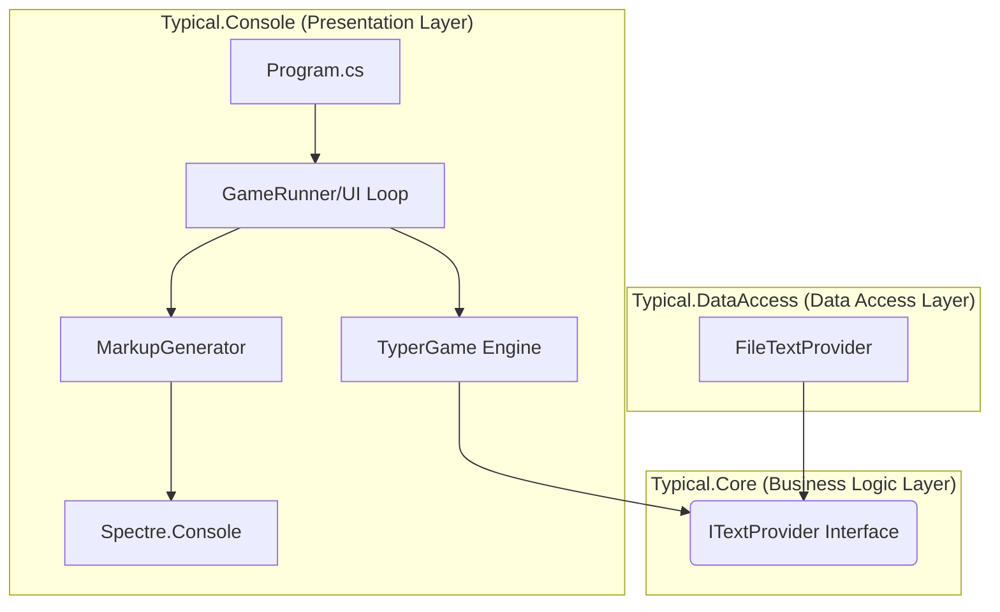
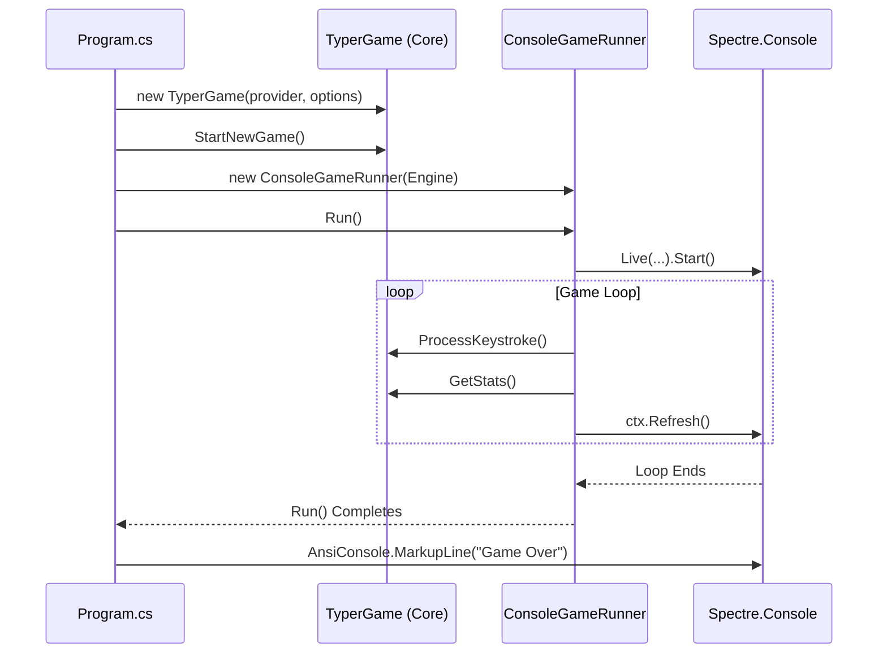

# Docs

```mermaid
graph TD
    subgraph "Typical.Console (Presentation Layer)"
        direction LR
        A[Program.cs] --> B[GameRunner/UI Loop];
        B --> C[MarkupGenerator];
        C --> D[Spectre.Console];
        B --> E[Typical.Core];
    end

    subgraph "Typical.Core (Business Logic Layer)"
        direction LR
        E[TyperGame Engine] --> H(ITextProvider Interface);
    end

    subgraph "Typical.DataAccess (Data Access Layer)"
        direction LR
        I[FileTextProvider] --> H;
    end
```

---

```mermaid
sequenceDiagram
    participant Program as Program.cs
    participant Engine as TyperGame (Core)
    participant Runner as ConsoleGameRunner
    participant Spectre as Spectre.Console

    Program->>Engine: new TyperGame(provider, options)
    Program->>Engine: StartNewGame()
    Program->>Runner: new ConsoleGameRunner(Engine)
    Program->>Runner: Run()
    Runner->>Spectre: Live(...).Start()
    loop Game Loop
        Runner->>Engine: ProcessKeystroke()
        Runner->>Engine: GetStats()
        Runner->>Spectre: ctx.Refresh()
    end
    Spectre-->>Runner: Loop Ends
    Runner-->>Program: Run() Completes
    Program->>Spectre: AnsiConsole.MarkupLine("Game Over")
```
