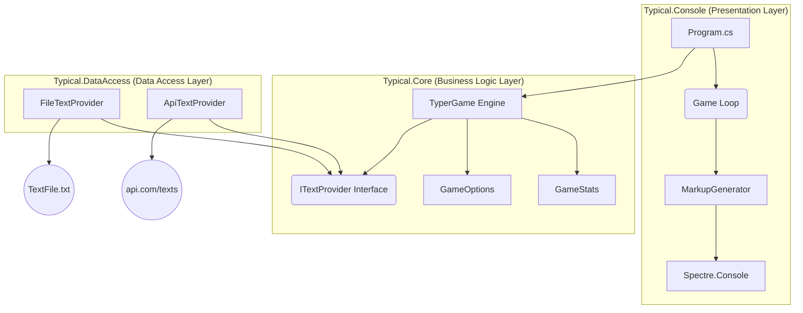
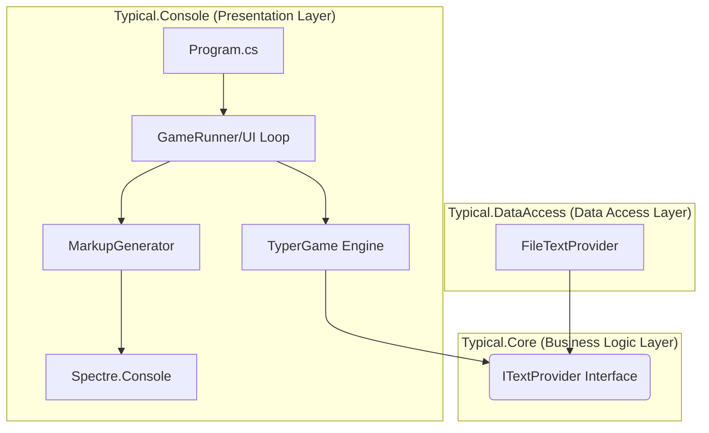

```mermaid
graph TD
    subgraph "Typical.Console (Presentation Layer)"
        direction LR
        A[Program.cs] --> B(Game Loop);
        B --> C[MarkupGenerator];
        C --> D[Spectre.Console];
    end

    subgraph "Typical.Core (Business Logic Layer)"
        direction TB
        E[TyperGame Engine] --> F[GameStats];
        E --> G[GameOptions];
        E --> H(ITextProvider Interface);
    end

    subgraph "Typical.DataAccess (Data Access Layer)"
        direction TB
        I[FileTextProvider] --> H;
        J[ApiTextProvider] --> H;
    end

    A --> E;
    I --> K((TextFile.txt));
    J --> L((api.com/texts));
```

```mermaid
graph TD
    subgraph "Typical.Console (Presentation Layer)"
        direction LR
        A[Program.cs] --> B[GameRunner/UI Loop];
        B --> C[MarkupGenerator];
        C --> D[Spectre.Console];
        B --> E[Typical.Core];
    end

    subgraph "Typical.Core (Business Logic Layer)"
        direction LR
        E[TyperGame Engine] --> H(ITextProvider Interface);
    end

    subgraph "Typical.DataAccess (Data Access Layer)"
        direction LR
        I[FileTextProvider] --> H;
    end
```
